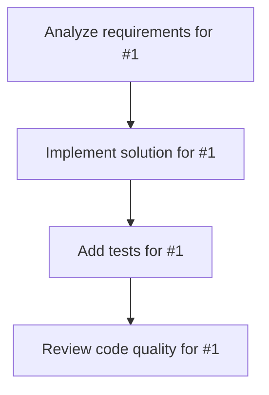

# Plans for Issue #1

**Title**: Add a simple calculator function

**URL**: https://github.com/FinShinjuku/miyabi-test-project/issues/1

---

## 📋 Summary

- **Total Tasks**: 4
- **Estimated Duration**: 60 minutes
- **Execution Levels**: 4
- **Has Cycles**: ✅ No

## 📝 Task Breakdown

### 1. Analyze requirements for #1

- **ID**: `task-1-analysis`
- **Type**: Docs
- **Assigned Agent**: IssueAgent
- **Priority**: 0
- **Estimated Duration**: 5 min

**Description**: Analyze issue requirements and create detailed specification

### 2. Implement solution for #1

- **ID**: `task-1-impl`
- **Type**: Feature
- **Assigned Agent**: CodeGenAgent
- **Priority**: 1
- **Estimated Duration**: 30 min
- **Dependencies**: task-1-analysis

**Description**: Create a simple calculator module with basic arithmetic operations:
- Addition
- Subtraction
- Multiplication
- Division

The calculator should:
- Be implemented in TypeScript
- Export a Calculator class
- Handle division by zero error
- Include unit tests

Example usage:
\`\`\`typescript
const calc = new Calculator();
calc.add(2, 3); // returns 5
calc.divide(10, 2); // returns 5
calc.divide(10, 0); // throws error
\`\`\`

### 3. Add tests for #1

- **ID**: `task-1-test`
- **Type**: Test
- **Assigned Agent**: CodeGenAgent
- **Priority**: 2
- **Estimated Duration**: 15 min
- **Dependencies**: task-1-impl

**Description**: Create comprehensive test coverage

### 4. Review code quality for #1

- **ID**: `task-1-review`
- **Type**: Refactor
- **Assigned Agent**: ReviewAgent
- **Priority**: 3
- **Estimated Duration**: 10 min
- **Dependencies**: task-1-test

**Description**: Run quality checks and code review

## 🔄 Execution Plan (DAG Levels)

Tasks can be executed in parallel within each level:

### Level 0 (Parallel Execution)

- `task-1-analysis` - Analyze requirements for #1

### Level 1 (Parallel Execution)

- `task-1-impl` - Implement solution for #1

### Level 2 (Parallel Execution)

- `task-1-test` - Add tests for #1

### Level 3 (Parallel Execution)

- `task-1-review` - Review code quality for #1

## 📊 Dependency Graph

## ⏱️ Timeline Estimation

- **Sequential Execution**: 60 minutes (1.0 hours)
- **Parallel Execution (Critical Path)**: 10 minutes (0.2 hours)
- **Estimated Speedup**: 6.0x

---

*Generated by CoordinatorAgent on 2025-10-24 02:04:47 UTC*
